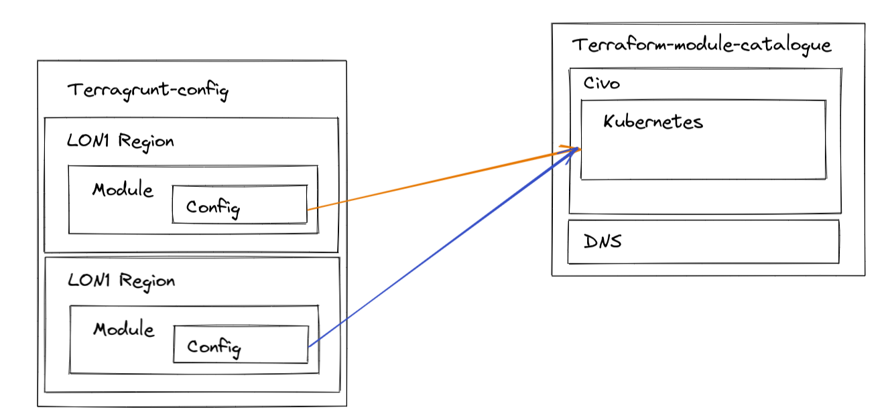

# terragrunt-configuration

This repository shows how to operate Terraform following DRY principals.

It uses the [terraform-module-catalogue](https://github.com/AlexsJones/terraform-module-catalogue) to house its modules.

To run this environment using [civo](https://civo.com) as the Kubernetes cloud provider you'll need the following:

- `CIVO_TOKEN` environment variable set
- `TERRAFORM_WORKSPACE_TOKEN` environment variable set ( to use terraform cloud )

